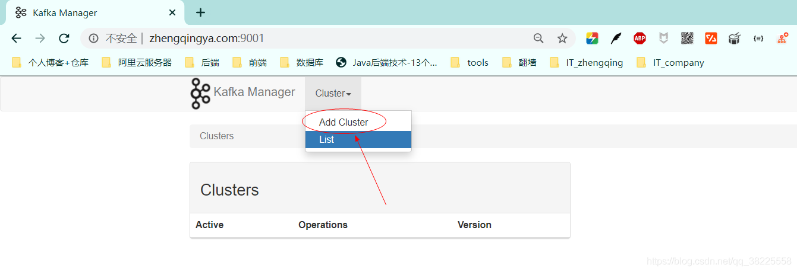
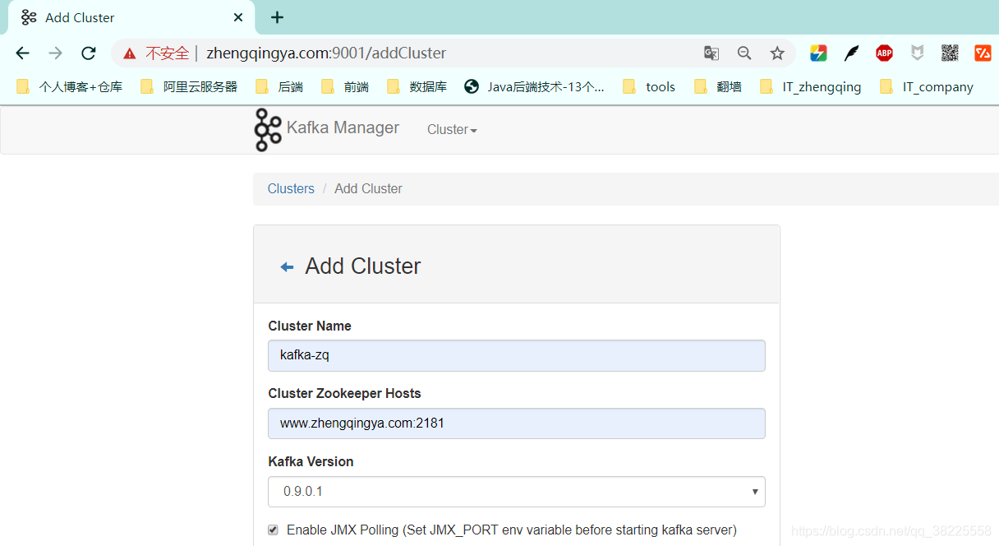
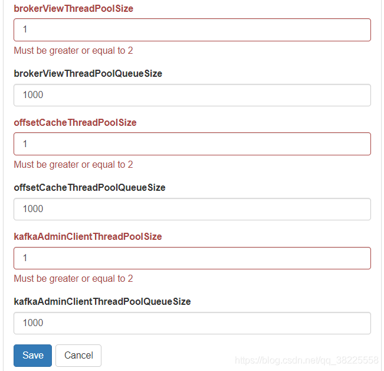
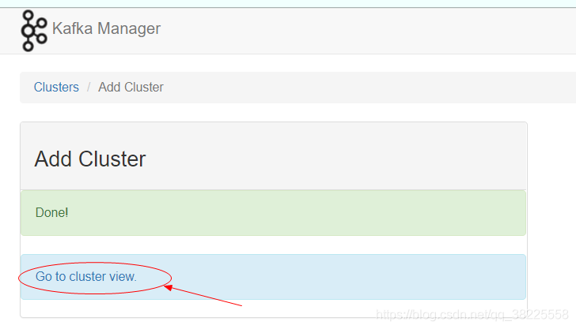
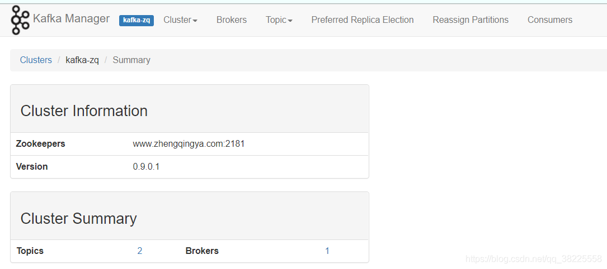
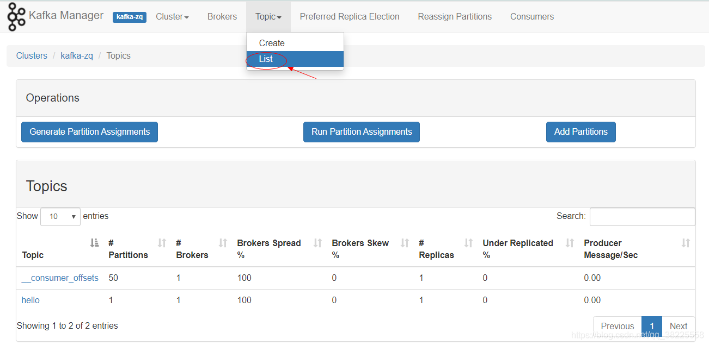

# Kafka

Kafka是一种基于分布式发布-订阅消息系统的开源软件。 其目标是提供高吞吐量、低延迟、可扩展性和容错能力。
Kafka中将消息存储在可配置数量的分区中，以便实现横向扩展，并且支持多个生产者和消费者，具有良好的可靠性保证机制。
除此之外，Kafka还支持数据复制、故障转移和离线数据处理等功能，并被广泛应用于网站活动跟踪、日志收集与分析、流式处理、消息队列等场景。

```shell
docker-compose -f docker-compose-kafka.yml -p kafka up -d
```

集群管理地址：[`ip地址:9006`](http://IP地址或域名:9006)

### kafka-manager 使用

1、新建Cluster: 点击Cluster -> Add Cluster



Save保存时出现如下提示至少为2，修改一下默认值为2即可~


2、查看topic




